# Đồ án quản lý vật tư
## Hướng dẫn cài đặt
Vì đồ án chạy thuần Windows nên các hệ điều hành khác đòi hỏi phải có máy ảo chạy hệ điều hành Windows 10. Để có thể kết nối với SQL Server 2014 thì trong hệ điều hành Windows 10 đó phải có Microsoft SQL Server 2014.

[Cách cài đặt Microsoft SQL Server 2014 trên hệ điều hành Windows 10](https://www.howkteam.vn/course/huong-dan-cai-dat/huong-dan-cai-dat-sql-server-102)

Sau khi đã cài đặt xong thì ta sẽ chạy file script có sẵn kèm theo sau khi tải source code từ github về. Ta sẽ làm theo các bước sau:

Chọn vào biểu tượng mũi tên đỏ để vào mở file script, và mở đúng file script tên qlvt.sql

Sau khi mở được file script thì ta sẽ thấy màn hình như sau, và ta ấn nút có biểu tượng ! để chạy script để có thể tạo ra cơ sở dữ liệu mà chúng em đã tạo từ trước

Lúc này ta ấn nút refresh lại

Và ta được kết quả như sau

Phiên bản java mới nhất không thể kết nối với Microsoft SQL Server 2014 nên ta phải dùng phiên bản java 15 để có thể kết nối với nó. Đầu tiên, ta truy cập [trang web này](https://jdk.java.net/archive/) và chọn phiên bản 15.0.2, chọn đúng mục Windows, và ấn vào dòng chữ xanh để tải. 

Sau khi đã tải xong, thì ta sẽ bắt đầu cài đặt như một chương trình bình thường, lúc và kiểm tra xem phiên bản java hiện tại đã được tải về máy hay chưa bằng cách mở cmd và gõ dòng lệnh sau: java --version. Nếu ra kết quả nhưng sau thì ta đã cài đặt thành công java vào máy.

Nếu chưa thành công, ta buộc phải vào folder bin của folder jdk-15.0.2 và copy đường dẫn của nó. Rồi ta tìm trong cửa sổ Windows với từ khóa "Environment Variables" và chọn mục xuất hiện đầu tiên:
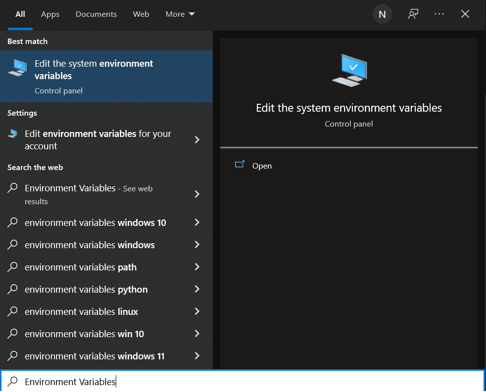

Chọn Environment Variables…

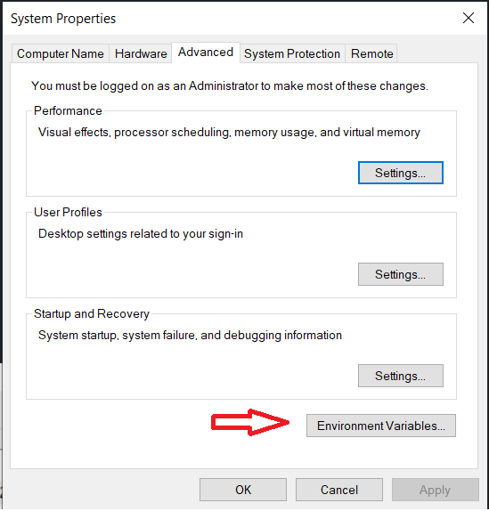

Đúp chuột vào phần Path

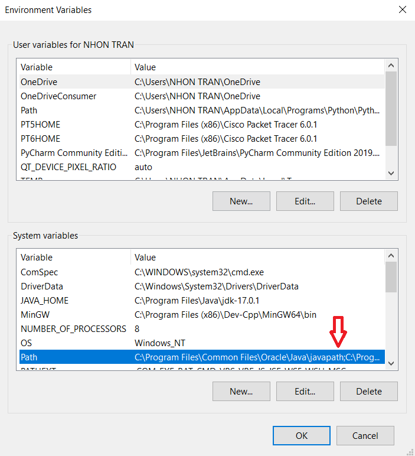

Chọn New

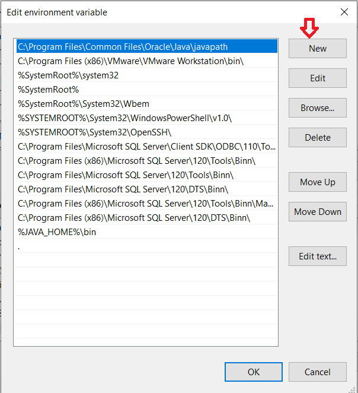

Paste đường dẫn vào

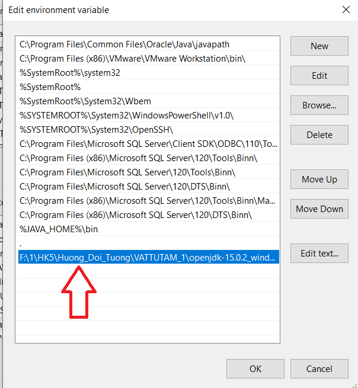

Ấn OK ở các bảng đang hiện ra để xác nhận thay đổi và tắt chúng đi, lúc này ta sẽ vào cmd kiểm tra lại lần nữa, khi có hiện ra kết quả như màn hình cmd ở trên thì có nghĩa là ta đã hoàn thành việc cài đặt java vào máy.

Tiếp theo, ta sẽ mở cổng 1433 và thiết lập một vài thứ với Microsoft SQL Server 2014. Ta làm theo các bước sau:

Vào phần tìm kiếm của Windows và SQL Server 2014 Configuration, ta sẽ được kết quả như sau:

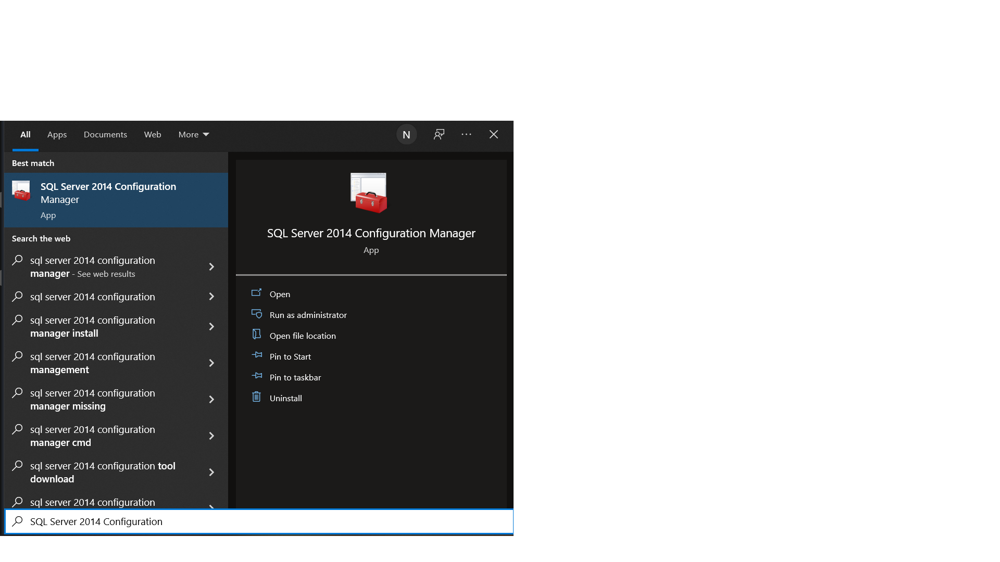

Chọn cái đầu tiên, thì ta sẽ được đưa đến một giao diện và chọn như hướng dẫn như sau:

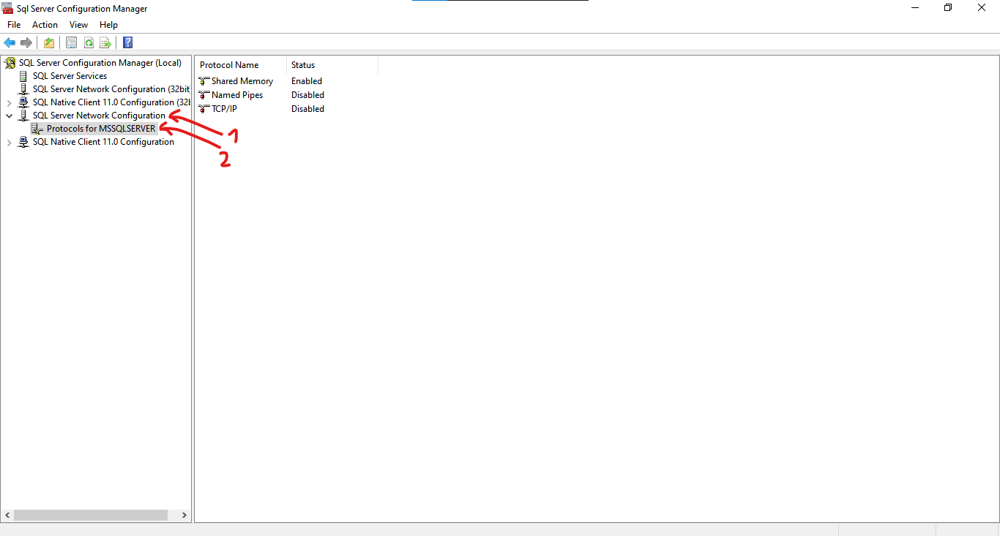

Ở bên phải, mục TCP/IP ta sẽ nhấp đúp chuột vào đó. Lúc đó, sẽ hiện ra một cửa sổ như sau:

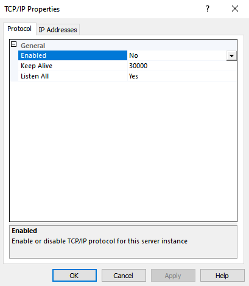

Ở phần Enabled, ta sử thành Yes hoặc ấn nút mũi tên bên cạnh và chọn Yes. Sau đó ta sẽ qua tab “IP Address”, tab “IP Address” sẽ hiện ra như sau:

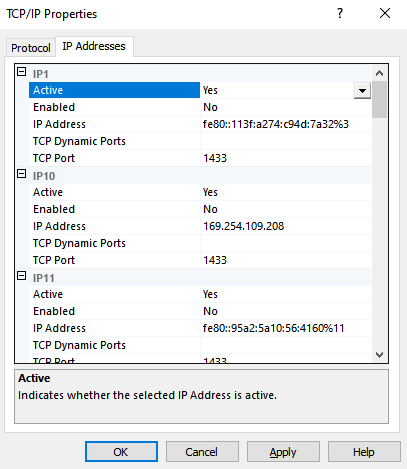

Ta sẽ kéo thanh cuộn xuống cuối cùng và ta sẽ thấy như sau:

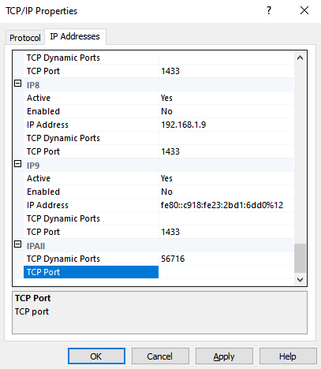

Ở mục TCP Port của IPAll thì ta sẽ thêm vào số 1433, là ta sẽ mở cổng 1433 cho phép kết nối với cơ sở dữ liệu. Sau khi đã hoàn tất thì ta sẽ ấn Apply, đợi một lát và ta sẽ nhấn phím OK. Tiếp theo ta sẽ chọn mục SQL Server Services:

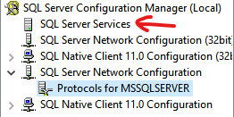

Click đúp vào đó ta sẽ được một bảng thông tin bên phải và ta chọn dòng có Service Type là SQL Server:

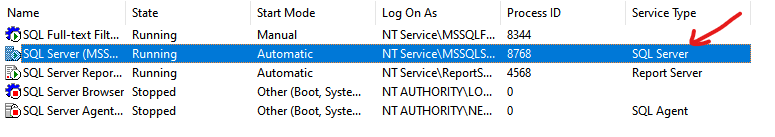

Ở đó, ta sẽ chuột phải và chọn Restart để SQL Server được khởi động lại:

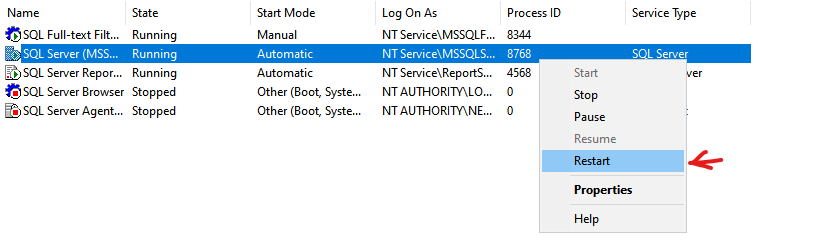

Lúc này màn hình sẽ hiện ra cửa sổ sau:

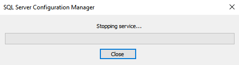

Việc của ta là đợi cho thanh chính giữa chạy hết và tự động tắt cửa sổ đi. Lúc này ta có thể tắt SQL Server Configuration Manager để làm bước tiếp theo.

## Chạy chương trình

Sau khi đã tải folder dưới dạng zip về máy, thì ta giải nén. Mở IntelliJ IDEA và ấn Open

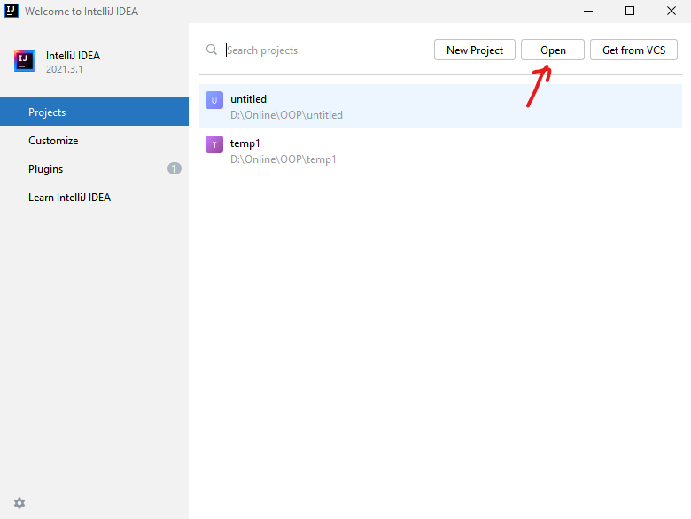

Lúc đó ta chọn đúng folder tên là material-management-project-OOP-main

Ấn OK và chờ cho đến khi việc thiết lập project hoàn tất. Sau khi đã thiết lập hoàn tất thì ta sẽ vào VATTUTAM_1 -> src -> ConnectSQL, sau đó kéo xuống dòng thứ 12 sửa password theo tài khoản sa tương ứng đã đặt.

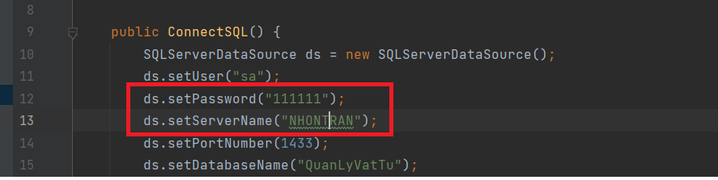

Sau khi đã chỉnh xong ta sẽ chuyển qua file java Login và Run 'Login.main()'.

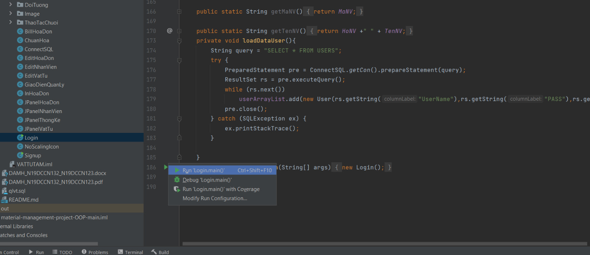

Chờ sau khi đã hoàn tất việc build project thì ta sẽ được cửa sổ sau đây

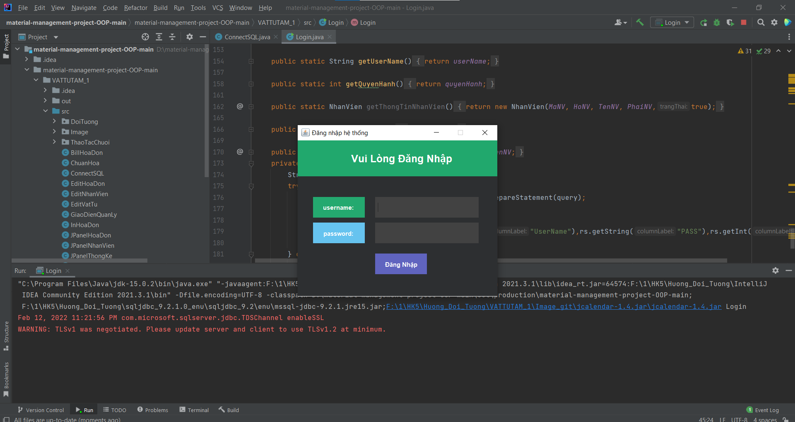

Nếu thấy được cửa sổ như thế này thì chương trình đã chạy thành công. Nếu không hiện ra cửa sổ và có lỗi thì ta sẽ xem xét lại từ bước cài đặt có bỏ bất kỳ bước nào hay không.
